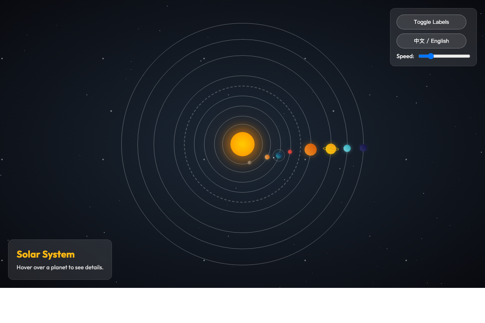

# Solar System Simulation / 太阳系模拟

A visually appealing and interactive simulation of the Solar System built with HTML, CSS, and Vanilla JavaScript.

## Features

- **Realistic Orbits**: Planets orbit the Sun at relative speeds based on real-world data.
- **Visual Details**:
  - Unique colors and gradients for each planet.
  - Saturn's rings.
  - Glowing Sun effect.
  - Starry background with twinkling stars.
- **Moon System**: Earth has a moon that revolves around it while maintaining a stable orbit ring relative to the viewer.
- **Asteroid Belt**: A dynamic asteroid belt between Mars and Jupiter with hundreds of scattered asteroids.
- **Interactive Elements**:
  - Hover over planets to see detailed information.
  - **Speed Control**: Adjust the simulation speed with a slider.
  - **Label Toggle**: Show or hide planet names.
- **Multi-Language Support**: Fully localized in **English** and **Chinese** (中文). Switch languages instantly with a toggle button.

## Technologies Used

- **HTML5**: Semantic structure.
- **CSS3**:
  - Keyframe animations for orbits and rotation.
  - CSS Variables for easy theming.
  - Advanced positioning for the "Zero-Size Wrapper" pattern to ensure perfect orbital alignment.
- **JavaScript (ES6+)**:
  - Dynamic generation of stars and asteroids.
  - State management for language and UI controls.
  - Event handling for interactivity.

## How to Run

1. Clone or download this repository.
2. Open `index.html` in any modern web browser (Chrome, Firefox, Safari, Edge).
3. Enjoy the simulation!

## Technical Highlights

### Moon Orbit Fix
One of the interesting challenges in this project was ensuring the Moon's orbit appeared correct. Since the Earth rotates around the Sun (and rotates itself), simply placing the Moon as a child element caused its orbit to wobble or rotate with the Earth.
We solved this by:
1. Using a **Counter-Counter-Rotation** technique: The Moon's orbit ring applies a reverse rotation animation to cancel out the Earth's orbital rotation, keeping the ring fixed in screen coordinates.
2. Separating the Moon's revolution into a `moon-container` that rotates independently within the fixed ring.

### Asteroid Belt
The asteroid belt is generated dynamically via JavaScript to create a natural, scattered look with varying sizes, opacities, and positions, rather than using a static image.

## Credits

This project was created using **Antigravity** and **Gemini 3**.

## License

This project is licensed under the MIT License - see the [LICENSE](LICENSE) file for details.
